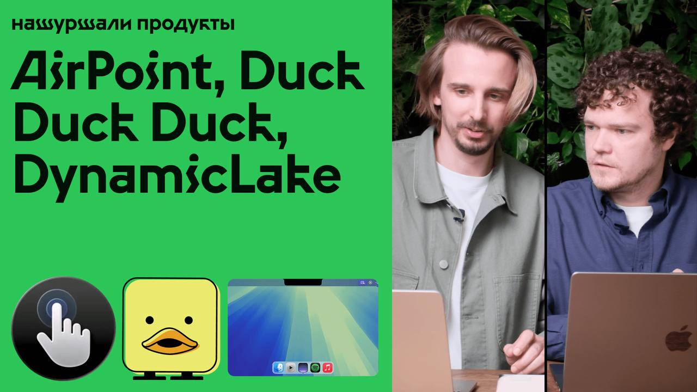

> 🪇 Нашуршали первый выпуск   
> Смотреть: https://youtu.be/GG6visgV5rs  
>   
> Разбираем 3 новых продукта, которые нас зацепили:  
>   
> AirPoint  
> Управление компом без мышки и трекпада. Курсор двигается за рукой через веб-камеру, а популярные действия можно назначить на жесты.  
> Сайт: https://www.airpoint.app/  
> Product Hunt: https://www.producthunt.com/products/airpoint  
> Автор — Mario Andres “Andrew” Flores: https://x.com/andrewflowersmd  
>   
> Duck, Duck, Duck! от IDEO  
> Физическая и виртуальная AI-утка для Claude Code. Следит за сессией кодинга, реагирует на происходящее и помогает не терять контекст.  
> Сайт: https://duck-duck-duck.edges.ideo.com/  
> Product Hunt: https://www.producthunt.com/products/duck-duck-duck-by-ideo  
> GitHub / скачать приложение: https://github.com/ideo/duck-duck-duck  
> Команда проекта:  
> Jenna Fizel — https://www.linkedin.com/in/jftesser  
> Danny DeRuntz — https://www.linkedin.com/in/danny-deruntz-3200b419  
> Andrew Reischling — https://www.linkedin.com/in/andrew-reischling-9611b7167  
>   
> DynamicLake  
> Приложение, которое превращает чёлку MacBook в интерактивный остров с музыкой, уведомлениями, файлами и другими полезностями.  
> Сайт: https://www.dynamiclake.com/  
> Product Hunt: https://www.producthunt.com/products/dynamiclake  
> Автор — Avior Rokach: https://x.com/AVIROK1  
>  
> — [Нашуршали](https://t.me/nashurshali/6)

