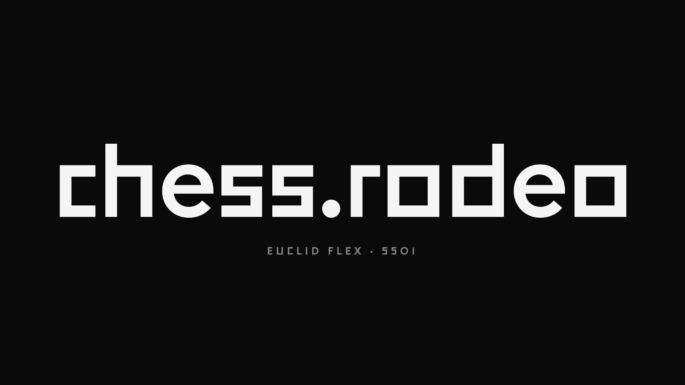

Went through 30+ typefaces from six foundries to figure out how exactly to set "chess.rodeo." Landed on Euclid Flex with stylistic set ss01 — its squared-off shapes read both as chessboard squares and as a rodeo champion's belt buckle.

## Why

chess.rodeo had a working but bland logo — just text in the default UI typeface. I wanted the logo itself to carry meaning: hint at both chess and the "rodeo" — the fast, untamed game.

The idea was to build a single lab page where every variant sits side by side, so I could scroll and compare for real: "C with a small r inside" monograms, "Chess rodeo" wordmarks, knight-as-r variants like "Chess ♞odeo" and "C♞". All across the same 30+ typefaces. There's no other way to tell what actually works.

## What went into the comparison

The backbone is Swiss Typefaces, my favorite foundry for UI work:

- **[Suisse](https://www.swisstypefaces.com/fonts/suisse/)** — Intl, Cond, Neue, Screen, Works. The whole family, from classic Helvetica-like Intl to the screen-tuned Screen cut.
- **[Euclid](https://www.swisstypefaces.com/fonts/euclid/)** — Circular A/B (like Circular Mono), Flex (the hero), Square (already in chess.rodeo's UI), Triangle.
- **[SangBleu](https://www.swisstypefaces.com/fonts/sang-bleu/)** — Kingdom and Empire. Serifs with character.

Then some experimental / "character" picks to see the full range:

- **[New Paris](https://productiontype.com/family/new-paris)** from Production Type — King Size and Air, a grotesque with a French accent.
- **TheW NYC** — a magazine typeface with a Clan sub-series (ODB, GZA, RZA — yes, Wu-Tang references). Just to play with.
- **Raskal Oner** — Cyrillic graffiti script. To see if "rodeo" reads better hand-written.
- **BRRR** — a fun stylistic set called "Skrrt," rap ad-libs as typography.
- **Only Extended** in three weights — wide grotesque with airy grace.
- **I Can See You All** — one all-caps cut.

And **Chessvetica** by Fay Does Design — a special typeface with chess piece glyphs, used here as the "knight" in the "Chess ♞odeo" variants.

## Full lab

All 30+ variants are right below — scroll and toggle the knight (filled ↔ outlined):

  <fieldset class="ll-toggle">
    <legend>Knight</legend>
    <label><input type="radio" name="ll-knight" value="filled" checked> Filled</label>
    <label><input type="radio" name="ll-knight" value="outlined"> Outlined</label>
  </fieldset>
  

  

    
Knight glyph — <a href="https://faydoesdesign.com/portfolio/chessvetica/" target="_blank" rel="noopener">Chessvetica</a> by Fay Does Design.

    
All typefaces here are trial versions for evaluation. If you like one, support the foundry and buy a working license.

  

## What got cut and why

**Raskal and BRRR** were the first to go. Too loud. Chess projects come with a baseline expectation of typographic seriousness — even a fast online tool. Graffiti and hip-hop ad-libs made the logo feel unserious and broke the link to the actual game.

**TheW Clan (ODB/GZA/RZA)** was fun, but not mine. The aesthetic is very specific — 90s New York, Wu-Tang — and chess.rodeo is in a different context entirely.

**Suisse Neue / Works / Screen** — all three read as "reliable, but doesn't stand out." Workhorses, not logo material.

**SangBleu Kingdom and Empire** — the serifs were beautiful but not "playful." No chess, no rodeo — just good typographic taste.

**Round-only Euclid Circular A/B** — too soft. Circles don't grab onto the board idea.

## What stuck

**Euclid Flex** with stylistic set ss01.

Why:

- **Squared proportions**. Digits and most lowercase glyphs in Flex have an almost perfectly square bounding box. Every letter is a chessboard cell. No decorative tricks needed — the typeface itself already carries the idea.
- **Stylistic set ss01** swaps several glyphs (a, g, l, the dot on i) for more geometric versions. Without ss01, Flex drifts toward a "regular" grotesque; with ss01, it becomes distinctive.
- **Double reading**: the squares are both chessboard cells (8×8) and the silver belt buckles rodeo champions wear. One typeface, two associations. That's the "coincidence" I was looking for.
- **Scales well**. From a 16px favicon to a 1500px social banner — the shapes hold.

One unplanned bonus: Flex already pairs with **Euclid Square**, which is what runs in chess.rodeo's UI. Logo and interface — same family.

