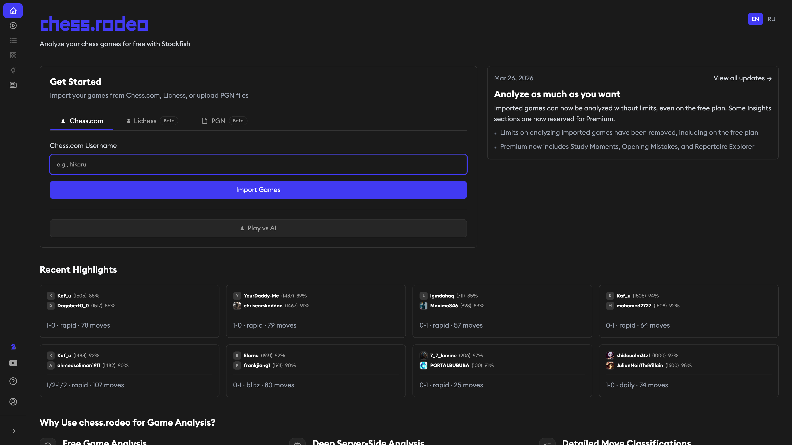
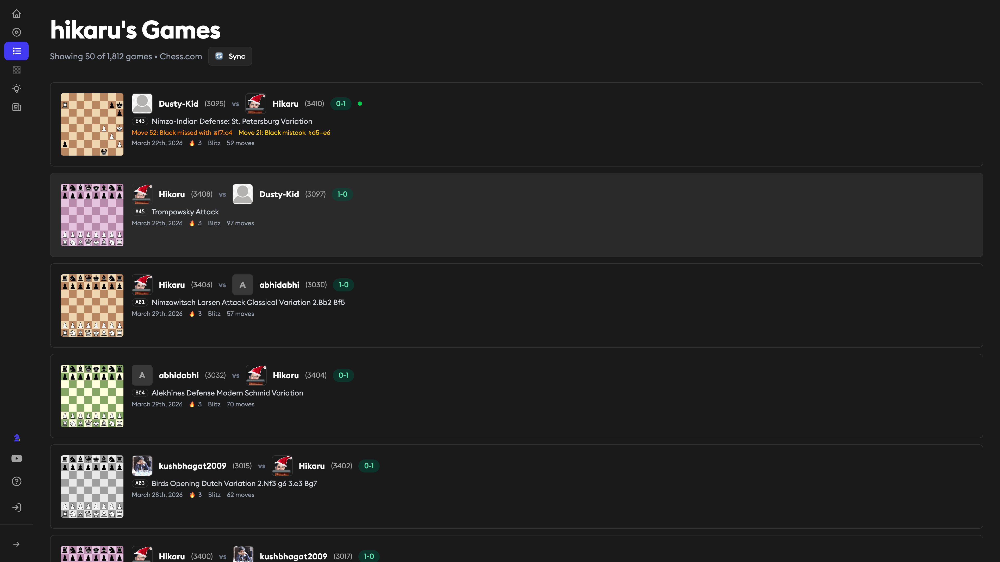
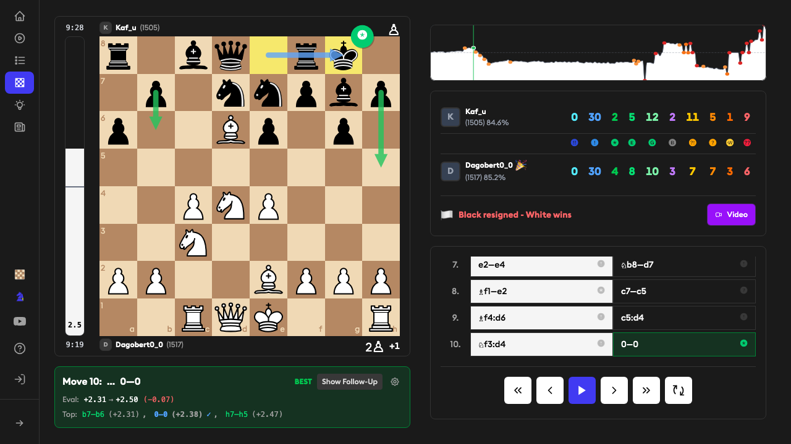
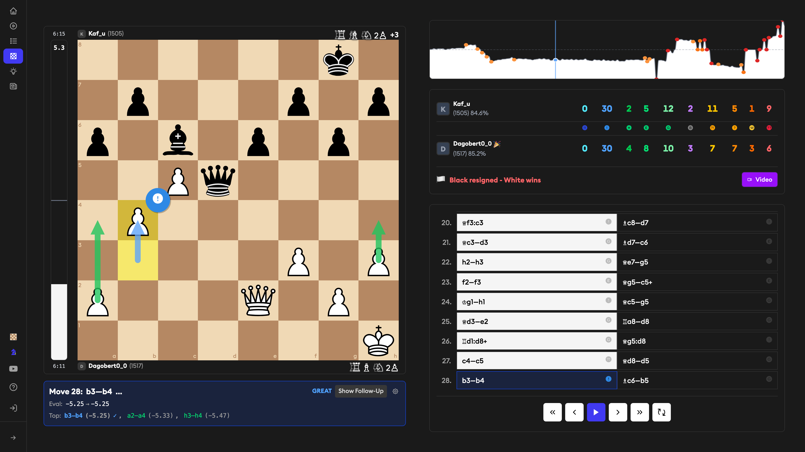

18,000+ games analyzed. Zero paywalls. Powered by Stockfish.

## Why

Game analysis on Chess.com and Lichess feels outdated. Clunky UI, slow processing, constant back-and-forth clicking to find your mistakes. I wanted something modern, fast, and actually pleasant to use — a tool that shows you what went wrong at a glance, not after 15 clicks.

So I built [chess.rodeo](https://chess.rodeo).

## How it works

Paste your Chess.com username, hit import, pick a game. Stockfish analyzes every move — no queue, no limits.

Every move gets classified:

- Brilliant (!!) and Great (!) — your best moments
- Good (✓) — solid play
- Inaccuracy (?!), Mistake (?), Blunder (??) — where things went wrong

Plus accuracy scores, evaluation graph, and what Stockfish would have played instead.

## What you get

- **Move-by-move breakdown** — every move labeled with accuracy grade
- **Evaluation graph** — see the exact moment you lost the advantage
- **Accuracy scores** — compare both players against perfect play
- **Opening recognition** — ECO codes and opening names, automatically
- **Best move suggestions** — learn what Stockfish would do in your position
- **Chrome extension** — analyze Chess.com games with one click, without leaving the site

## Under the hood

Analysis powered by Stockfish. Games stored in PostgreSQL.

## Try it

[chess.rodeo](https://chess.rodeo) — free, no account required.
