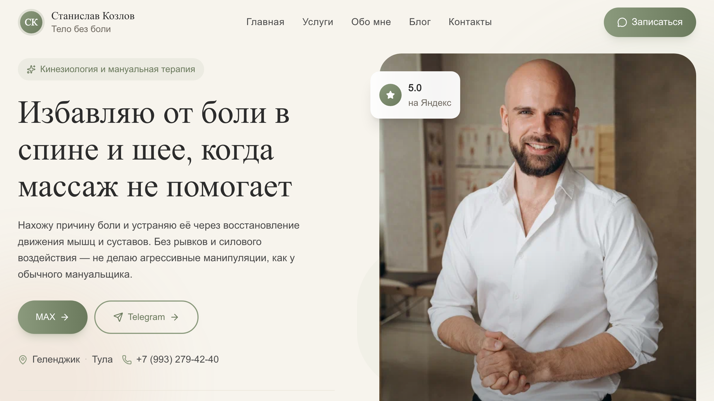
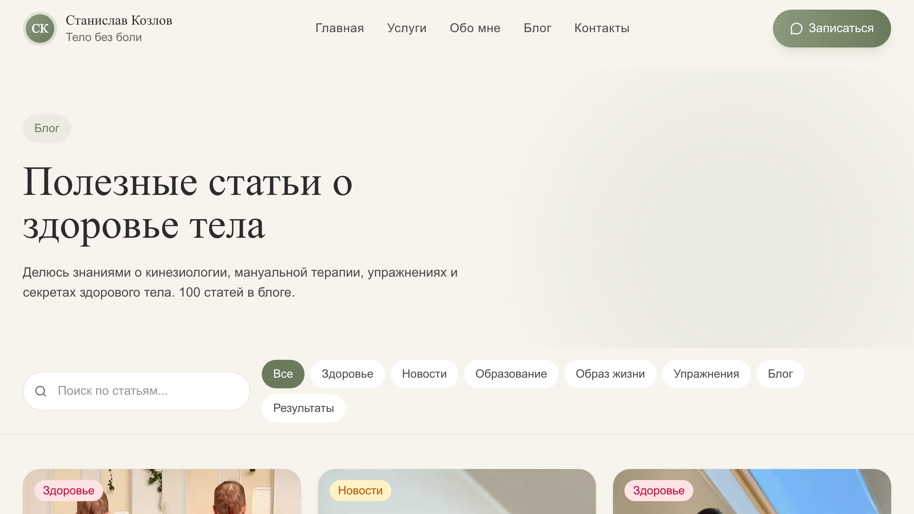
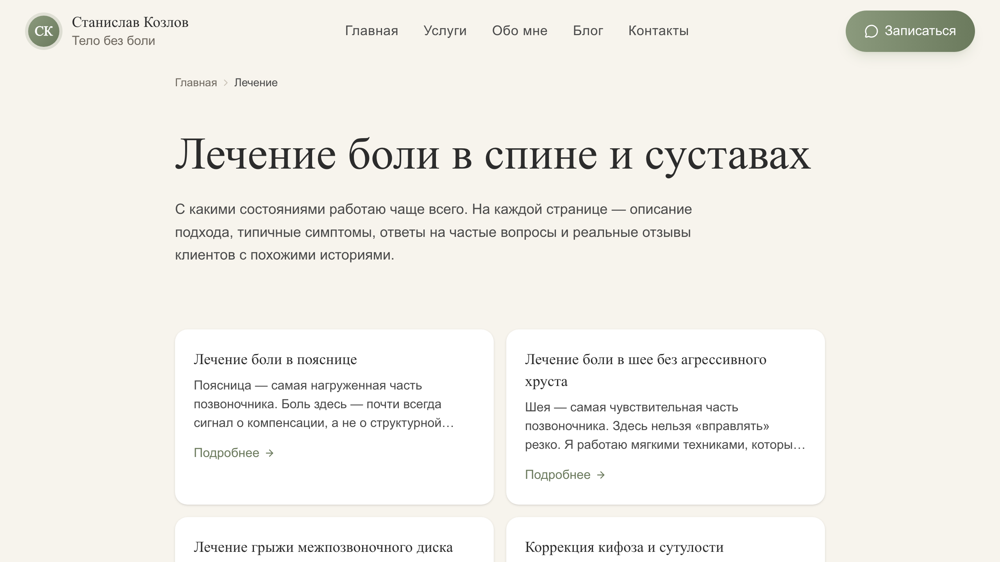

A practitioner's site with an auto-updating blog: my brother posts to a Telegram channel, the site updates itself. I imported 100 posts on the initial run.

## Why

My brother is a kinesiologist in Gelendzhik, Russia, running the Telegram channel @staskinesio. Each post is a technique photo, an exercise video, or a short case write-up. The goals:

- one entry point: "Google me → book me," without digging through Telegram;
- a blog that updates itself, no editor, no CMS;
- SEO presence on local commercial queries — "osteopath Gelendzhik," "back pain treatment," etc.

## How the Telegram-to-blog pipeline works

The main technical bit of this project. I have a Node package, [koztv-blog-tools](https://www.npmjs.com/), pulled out of logic I already run on other sites. It:

- connects to Telegram via a Telethon-compatible session;
- pulls messages in batches of 30, stopping at the first one that already exists;
- groups multi-message posts (Telegram splits long text into 2-3 messages — you have to stitch them back);
- deduplicates by `msg_id`;
- compresses videos with `ffmpeg` to a reasonable size;
- lays everything out as `public/posts/{id}/ru.md` with media alongside.

On top of that — a GitHub Action that runs daily at 04:00 Moscow (01:00 UTC), invokes the package, commits the delta, and via `workflow_run` triggers a rebuild and redeploy. My brother just posts to the channel; the site updates itself.

Telegram is not "just a text source." What broke along the way:

- **Markdown from bots vs. web client differs.** Multi-line **bold** broke the parser. Fixed with regexes in `koztv-blog-tools`.
- **Slugs were generated from junk** in the `Attachments:` block. A separate `cleanContent` strips attachments before URL generation.
- **Category assignment uses weighted keyword scoring**, not first-match — otherwise "neck warm-up" would land in "Lifestyle" instead of "Exercises."

## Performance: from PSI 80 to 90+

The site is static Next.js 16 (`output: 'export'`). Should be hard to make slow. Mobile PSI with slow-4G emulation and 4× CPU throttling proved otherwise — Lighthouse mobile sat stably at 80-83, with element render delay eating the budget.

What pushed it to 90+:

1. **Partytown for analytics.** GA + Yandex Metrika (~250 KB of JS) moved into a Web Worker via `@qwik.dev/partytown`. A thin `gtag/ym → forward` proxy stays on the main thread, so existing `trackBookAppointment` calls keep working unchanged.
2. **Inline critical CSS** via `beasties` (Critters successor). Above-the-fold rules get inlined into a `<style>` tag; the original stylesheet swaps in async via `rel="alternate stylesheet preload" + onload`. Cuts 180 ms of render-blocking CSS.
3. **`font-display: optional` instead of `swap`.** PSI reported LCP 5.0 s while local Lighthouse clocked 2.7 s. The gap was a repaint when Nunito arrived over fallback: Next's adjusted-fallback isn't perfect for Cyrillic glyphs, and the second paint triggered LCP. With `optional`, the browser commits to fallback if the woff2 doesn't arrive within ~100 ms. LCP locks to FCP.
4. **`content-visibility: auto` on below-fold sections.** The browser skips layout and paint for seven below-fold sections until they scroll into view. CLS stays at 0 thanks to `contain-intrinsic-size`.
5. **Pre-compressed assets.** `.gz` siblings get generated at build at level 9 (~5% tighter than runtime level 5, and zero CPU per request). Nginx serves them via `gzip_static`.

Hit a classic regression along the way: after a Server Components refactor, `index.html` doubled (120 KB → 210 KB). Every `<Reveal>` wrapper introduced a server→client boundary, and the RSC stream serialized every section as props. Rolled the homepage back to `'use client'`, and replaced 27 `IntersectionObserver` instances with one shared `RevealActivator` mounted in the root layout.

## Deploy: 1.1 GB → 100 MB

Every push used to round-trip 1.1 GB through ghcr because 956 MB of Telegram media was baked into the nginx layer. Update one post — a full gigabyte over the wire.

What I did:

- `Dockerfile`: `rm -rf out/posts` after build. HTML still references `/posts/{id}/...`, but the files live on the host now.
- A separate rsync job ships `public/posts/` to `/var/www/staskoz-posts/` incrementally (deltas only).
- The container mounts that volume read-only.
- `HEALTHCHECK` on the runner image; the deploy step waits for `healthy` before completing.
- The Caddyfile is rendered from a template; mv + reload only if the `md5` actually differs.

Result: 100 MB image instead of 1.1 GB, the daily blog cron deploy takes ~1 min instead of 3-4. Hosting is Caddy + nginx-alpine on the same box as my other sites, TLS via Let's Encrypt is auto-provisioned.

## SEO scaffolding

Separate landings for commercial queries:

- `/lechenie/{condition}/` — 7 pages by pain type and posture problems.
- `/uslugi/{service}/` — massage, manual therapy, kinesiology.
- `/lechebnyy-massazh/` — narrow landing for the Gelendzhik geo query.
- JSON-LD everywhere: `MedicalBusiness`, `MedicalProcedure`, `FAQPage` with real questions.

One copy story: after review, my brother asked me to drop "no cracking" from the homepage. Cracking does happen with some techniques, just not aggressively. We moved the honest explanation into the FAQ — which technique, what kind of cracking, why it's fine. SEO didn't regress; trust on the landing went up.

## Stack

Next.js 16 (App Router) + React 19 + Tailwind v4 + Framer Motion, static export via `output: 'export'`. Content from Telegram via the `koztv-blog-tools` npm package (mine). Analytics in Partytown. Hosting: Docker + nginx-alpine behind Caddy on my own server, TLS via Let's Encrypt. GitHub Actions — two workflows: `update-blog.yml` (cron, pulls from Telegram) and `deploy-server.yml` (push → build → rsync → restart).

## See it

[staskoz.com](https://staskoz.com)
